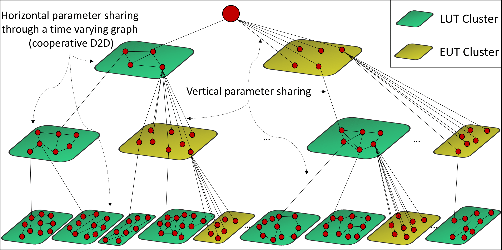

## Federated2Fog

**Please note that the code here is corresponding to the equations in v4 of paper on ArXiv. for versions > v4 of the the paper, we have updated equations which tighten the bounds of corresponding equations in v4. Similar plots can be obtained using the updated equations by adjusting the value of $\chi$ as mentioned on page 12 of updated manuscripts.**



- ArXiv: [Multi-Stage Hybrid Federated Learning over Large-Scale Wireless Fog Networks](https://arxiv.org/abs/2007.09511)
- Github: [Federated2Fog](https://github.com/shams-sam/Federated2Fog)
- Data and Code: [Drive Link](https://drive.google.com/file/d/1K89GiVj2Bti8aBu4khxcG4k0TtpAMgKj/view?usp=sharing)

### Details
- `alpha` in the code represents `$\sigma$'s` in the equations
- `omega` in the code represents `$M$` in the equations
- learning rate (`lr`) and `$\eta$` are two different parameters

### Hyperparameters
- Hyperparamters are stored in separate files
  - [hyperparameters.txt](https://github.com/shams-sam/Federated2Fog/blob/master/src/hyperparameters.txt) for 125 node experiments
  - [hyperparameters_625.txt](https://github.com/shams-sam/Federated2Fog/blob/master/src/hyperparameters_625.txt) for 625 node experiments
- These need to be replaced in [arguments.py](https://github.com/shams-sam/Federated2Fog/blob/master/src/arguments.py) [`__init__`](https://github.com/shams-sam/Federated2Fog/blob/master/src/arguments.py#L5) function call to regenerate the plots

### Plots
- The list of selected plots is summarized in [plots.txt](https://github.com/shams-sam/Federated2Fog/blob/master/plots.txt)
- Download the data from the drive link provided to access the generated plots.

### Misc.
Also available in the drive link (above)  provided:
- Pretrained models 
- Training histories 
- Training logs
- Preprocessed datasets
- etc.

### Citation
If you find Federated2Fog useful, please cite the following paper
```
@article{hosseinalipour2020multi,
  title={Multi-Stage Hybrid Federated Learning over Large-Scale D2D-Enabled Fog Networks},
  author={Hosseinalipour, S and Azam, SS and Brinton, CG and Michelusi, N and Aggarwal, V and Love, DJ and Dai, H},
  journal={arXiv preprint arXiv:2007.09511},
  year={2020}
}
```
